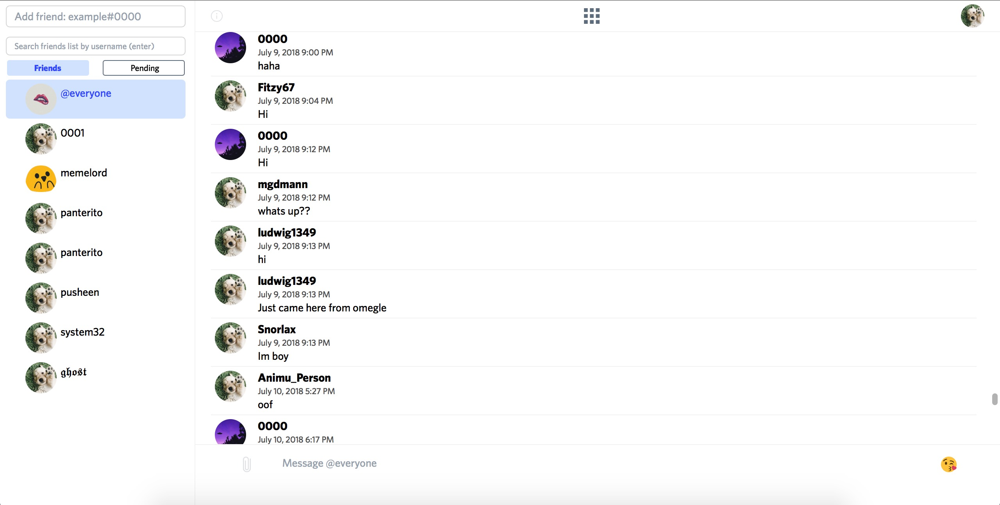
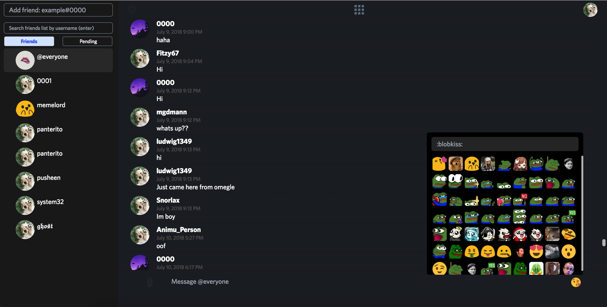
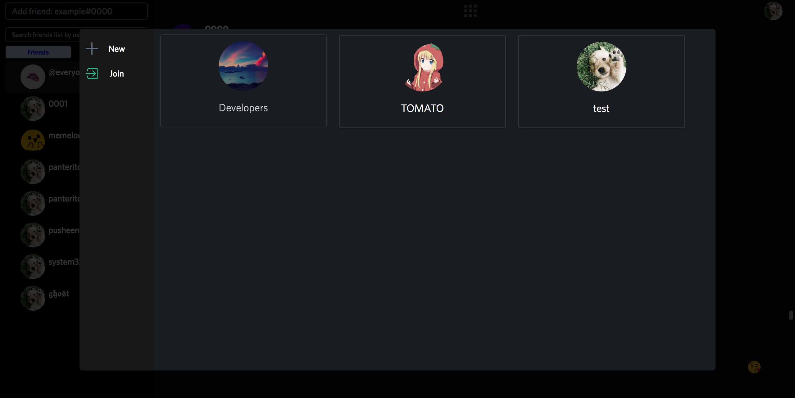

# Licc.me

Lightweight chat website 👅

## Screenshots

Try it here [Licc.me](https://licc.me). Since I cannot guarantee the domain or server will still be used to host this project in the future, screenshots above are provided.

## Setup

Setup NGINX using the file in ``nginx.conf``

Create collections and their indexes in MongoDB using the lines in ``DATABASE.js``

## Built with

* [ws](https://github.com/websockets/ws) - WebSockets
* [mongodb](https://github.com/mongodb/node-mongodb-native) - MongoDB Driver
* [sharp](https://github.com/lovell/sharp) - Image utility
* [bcryptjs](https://github.com/dcodeIO/bcrypt.js) - bcrypt

## Status

Discontinued. Releasing the source.